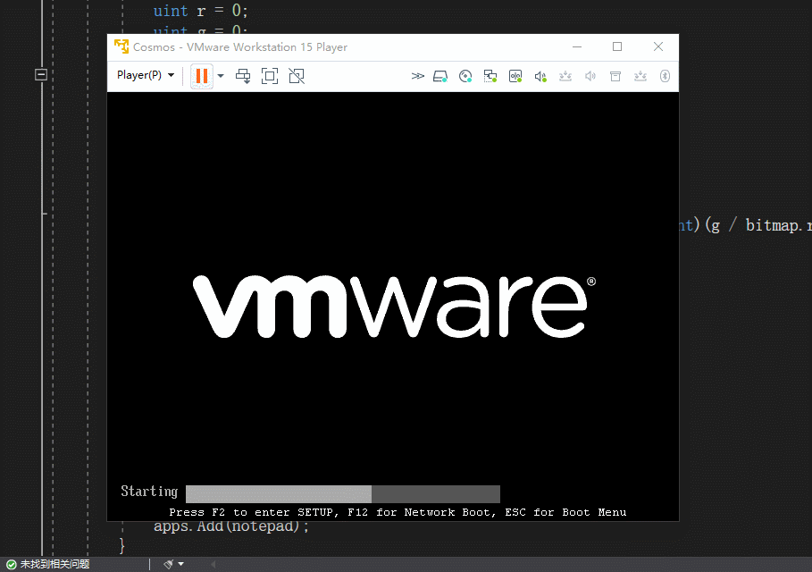
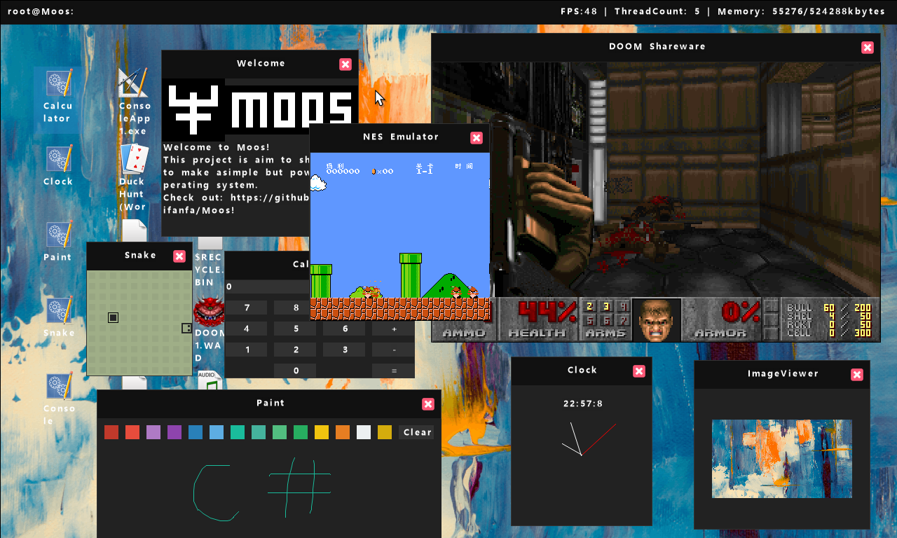
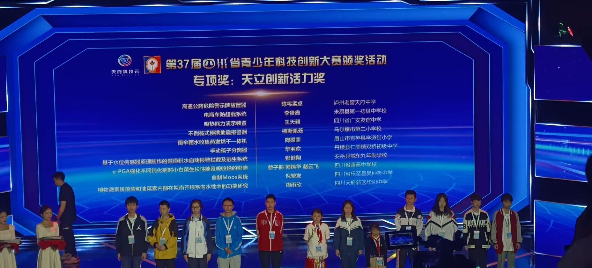

# 这是nifanfa个人的网站
## 

# 日志
[家庭宽带Full Cone NAT网络环境下使用Classicstun协议获取UdpClient的公网IPEndPoint](stun/)  
[我的联系方式](contact/)  
  
# 个人介绍  
## 主要成就
*"NoFRP"项目**创始人***   
*第二十三届资阳市青少年科技创新大赛**二等奖***  
*第三十七届四川省青少年科技创新大赛**一等奖***  
*"MOOS"操作系统**作者***  

# 这是nifanfa
  
  
## 早期经历
我叫*nifanfa*，05后，很小的时候就对计算机十分痴迷，小学的时候就经常和同学去黑网吧打穿越火线。直到小学五年级才有了自己的第一台计算机——HP Compaq 6005 Pro。那个时候我对操作系统也很感兴趣，经常购买盗版 Windows 光盘来安装操作系统。如果觉得 Windows 7 用腻了，我就会切换到 Windows XP。当时我装过最离谱的系统是中标麒麟系统，那也是我第一次接触 Linux 操作系统。不过装好之后发现 Linux 上的软件很少（应该说几乎没有桌面软件），结果我不知道怎么切换回 Windows。这让我对 Linux 桌面系统的第一印象很差，现在也是这样。

当时我尝试了很多操作系统，甚至想自己制作一个。我在网上看到一本叫做《30天自制操作系统》的书，好像是由一位名叫川和秀实的日本人写的。我下载了电子版，但最终还是放弃了，因为当时我唯一接触过的编程语言是易语言。

那时候我的配置是 AMD X4 610e 和 GTX 550 Ti，虽然不太适合游戏，但我还是玩了一些游戏，比如穿越火线和 QQ 飞车。

六年级的时候，我对虚幻引擎 4 的开发非常感兴趣。虚幻 4 的逻辑甚至不需要编写代码，只需使用蓝图编程（类似连线）。我沉迷于这个领域，常常找各种理由请假（甚至装病）以便更多时间投入其中。后来我还学会了 Blender 建模等技能。

不过后来我不知道为什么也厌倦了虚幻 4，转而尝试了 Unity3D，结果学会了 C#。不过对游戏开发的兴趣逐渐减退，毕竟这需要花费大量时间和金钱。

## C#初学者
后来我开始涉足 C# 开发。最初，我用 WinForms 编写了一个“安全教育平台”的自动答题程序。因为“安全教育平台”的答案可以通过浏览器的审查元素轻松获取。

随后，我继续进行了许多 WinForms 开发。不久之后，我又尝试了安卓开发，同样使用了 C#（C# 简直是个全能的语言）。当时我使用的是 Xamarin.Android。然而，微软的变化令人头疼。现在他们又转向了 .NET MAUI。这种频繁的变动到底能否提供一个长期稳定的解决方案呢？

## 初尝操作系统
后来，我对操作系统开发产生了新的兴趣。我翻阅了川和秀实的那本书，但实际上，这本书只是让你按照步骤操作，而没有深入解释原理。它只是让你跟着做，而不是真正理解底层计算机知识。这让我感到有些沮丧。

后来的一天，我随意搜索了一下关于 C# 操作系统的内容，结果真的找到了一个框架叫做 Cosmos。Cosmos 是一个团队开发的操作系统套件，核心部分是一个名为 IL2CPU 的工具。IL2CPU 的作用是从 csc 编译生成的二进制文件中提取 IL 代码，并将其替换为汇编代码。这些代码以纯文本格式存在，这也是 IL2CPU 编译速度极慢的原因之一。

我花了大约一个月或两个月的时间，就做出了自己的第一个图形操作系统。当然，这只是随便尝试，效果并不是很好，但至少是我自己的成果。  
  

  
Cosmos 可以算是一个相对完善的操作系统套件，它提供了文件系统、视频输出和按键输入等功能。不过，Cosmos 的开发更偏向于软件开发，而不是内核开发。当时在 Gitter 上有很多 Cosmos 爱好者分享了他们使用 Cosmos 制作的操作系统。令我惊讶的是，几乎没有人专注于 GUI 的开发。

作为一门高级语言，C# 的垃圾回收非常重要。然而，由于 Cosmos 是一个独立的操作系统，没有 .NET 运行时，因此也无法实现垃圾回收。因此，Cosmos 基本上无法支持 GUI。

那张图的演示你猜为什么这么短？因为这个系统几秒钟之后就会因为内存泄漏而卡死。你甚至不能手动释放内存，因为 C# 根本不存在这种操作。在 C# 中，所有东西都继承自 Object 类（不考虑 ValueType 的装箱和代码优化），因此都需要单独分配内存。在没有垃圾回收的情况下，以下代码就会导致内存泄漏：

```cs
for(;;)
{
  Console.WriteLine("Hello, World!");
}
```

因此，基本上 Cosmos 无法使用。后来，我了解到了另一个由美国人 Phill Garcia 主导的 C# 操作系统套件，名为 MOSA（Managed Operating System Alliance）。与 Cosmos 相比，MOSA 的性能明显更高。它直接将IL代码编译为二进制机器码。

MOSA 的目标更加远大，至少他们考虑了跨平台。不过，对我来说，这些操作系统套件似乎都没有太大必要。后来，我 fork 了 MOSA 的项目，并将其改名为 MOSA-Core（已删除）。我只保留了精简的内核“Core”，但仍然存在内存泄漏的问题。 

## 初尝编译器
后来，我又开始研究 Cosmos 的 IL2CPU，并学习了一些汇编知识。我还自己编写了一个将 IL 代码转换为汇编代码的工具，我称之为“CS2ASM”。不过，后来我放弃了这个项目，因为在函数传值时我使用了栈，大量使用了 push 和 pop 指令，结果写复杂的程序时会莫名其妙地出现栈溢出的问题。

## 进一步C#开发
那个时候，好像 C# 的 Native AOT 已经出现了，不过好像还不叫 Native AOT，而是叫 Core RT。有一位名叫 Michal Strehovsky 的 .NET 开发者发布了一个名为 zerosharp 的项目，演示了如何使用 C# 进行有或无运行时的开发。其中有一个名为 efi-no-runtime 的示范项目，展示了如何使用 C# 开发 UEFI 应用程序。当时我对这个项目进行了一些探索。不过后来我意识到自己并没有学过 UEFI 开发，于是继续使用传统的 BIOS 开发方式。我采用了 Multiboot 协议作为引导方式，由 Grub2 或 syslinux 提供支持。随后，我开始着手开发自己的操作系统，尽管一开始并没有给它起名字，只是暂时称之为 Solution1。

我个人认为，做操作系统需要直观易懂。如果你做了一个命令行操作系统，普通用户怎么知道你的系统有什么功能呢？毕竟不是每个人都能理解 print 命令的含义。我最初的目标是开发一个桌面操作系统。

后来，我给我的操作系统起名为 MOOS（to make *M*y *O*wn *O*perating *S*ystem），意为“拥有自己的操作系统”。我计划将其作为一个操作系统开发套件开源，供大家使用。我甚至考虑编写一个取代 Cosmos 的兼容层。Cosmos 是一个从 2008 年开始的项目，但进展远远赶不上我几个月的进度。

随后，我为我的系统添加了多线程和多处理器支持，还编写了一些驱动程序。

谈到驱动，确实令人头疼。我认为操作系统中最复杂的部分之一就是驱动程序，也可以称之为硬件适配。与 Linux 不同，全球范围内的人都在为 Linux 写驱动，但我这里基本上都是我一个人在搞。贡献者通常只帮我修复一些小漏洞。编写驱动程序的过程需要查阅官方的编程手册，这对英语水平是一大考验。有些 PDF 文件甚至限制了复制粘贴，所以很多时候按照文档操作也不一定能成功。

后来，我还移植了一个游戏——DOOM（毁灭战士）。这应该是最早的 3D 游戏之一了。我才意识到 C 语言的地位是不可撼动的。毕竟它存在了这么多年，代码积累非常丰富。为了成功移植 DOOM，我甚至不得不用 C 语言重新编写了一些标准库函数。我这里还是从源代码编译的，直接在 Windows 或其他平台上运行，我都不敢想象有多难。

就操作系统而言，网络无疑是其中最重要的部分之一。在开发操作系统的过程中，我也学到了网络通信的原理，例如在局域网内使用 ARP 获取目标 IP 的物理 MAC 地址。我还实现了 IP 协议、UDP 协议、TCP 协议、DNS 协议和 DHCP 协议等。

最后，我把这个项目告诉了我的信息老师，他帮我报了比赛，结果获得了资阳市青少年科技创新二等奖和四川省青少年科技创新一等奖。
  

**这里站错位置了**  
  
此外，我还涉足了底层开发、反编译和逆向工程。我使用过 x64dbg 和 IDA Pro 等工具，
后来，我又尝试了 ASP.NET 和 SQL Server，对这些技术有了初步的了解。

2024年7月11日  
  
蜀ICP备2025152620号-1
