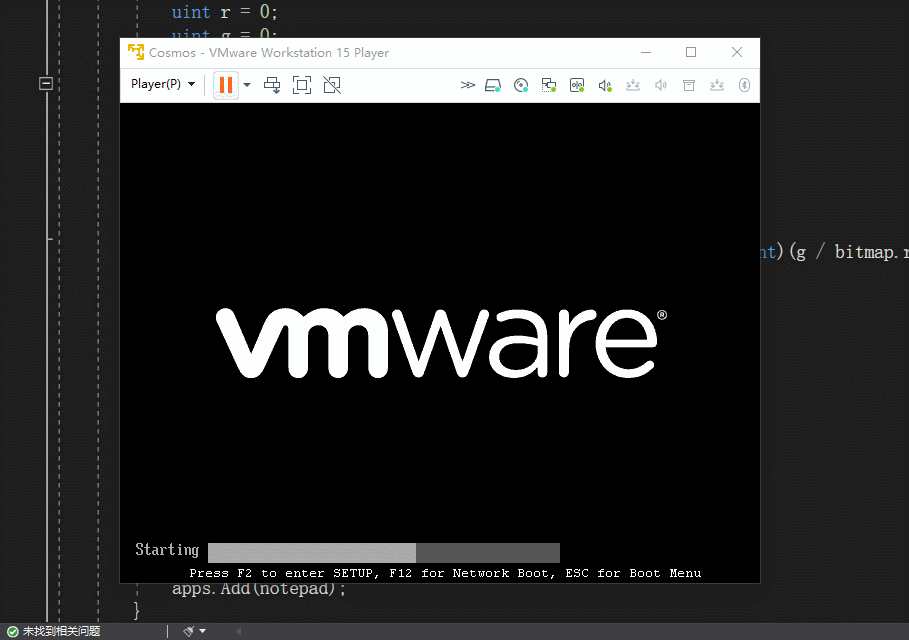
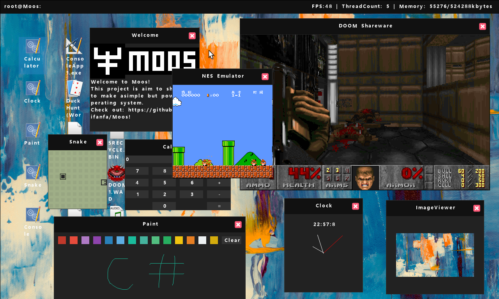

# 这是nifanfa个人的网站

# 日志
<ul>
  
    <li>
      {{ post.date | date: "%Y-%m-%d" }} - <a href="{{ post.url }}">{{ post.title }}</a>
    </li>
  
</ul>
  
# 个人介绍  
## 主要成就
*第二十三届资阳市青少年科技创新大赛**二等奖***  
*第三十七届四川省青少年科技创新大赛**一等奖***  
*"MOOS"操作系统**作者***  

# 这是nifanfa
  
  
## 早期经历
## 早期经历
我是 *nifanfa*，05后。小学五年级有了第一台电脑（HP Compaq 6005 Pro，配置 AMD X4 610e + GTX 550 Ti）。当时因装中标麒麟系统切不回 Windows，留下了对 Linux 桌面的糟糕初印象。

当时想自制 OS 读了《30天自制操作系统》，但因只懂易语言而放弃。六年级时沉迷虚幻 4 蓝图编程和 Blender 建模，后来转战 Unity3D 学会了 C#。

## C#初学者
我先用 WinForms 编写了“安全教育平台”自动答题程序，后续又通过 Xamarin.Android 涉足移动端开发（虽然吐槽微软技术栈从 Xamarin 到 .NET MAUI 变动频繁）。

## 初尝操作系统
为了深入底层，我找到了 C# 操作系统套件 **Cosmos**（核心是通过 IL2CPU 将 IL 代码替换为纯文本汇编）。我用它做出了第一个图形操作系统：



但由于独立 OS 没有 .NET 运行时与垃圾回收（GC），且 C# 万物皆 Object，导致系统几秒后就会因内存泄漏卡死。例如以下代码就会直接导致崩溃：

```cs
for(;;)
{
  Console.WriteLine("Hello, World!");
}
```

后来我又尝试了直接将 IL 编译为机器码的 **MOSA** 框架，并 fork 简化出了 MOSA-Core 内核，但仍受困于内存泄漏。

## 初尝编译器
研究 IL2CPU 后，我自制了将 IL 转换为汇编的工具 **CS2ASM**。但因函数传值过度使用栈，写复杂程序时易出现栈溢出，最终放弃。

## 进一步C#开发
受 zerosharp (CoreRT) 项目启发，我采用 BIOS + Multiboot 引导，开始开发自己的操作系统 **MOOS**（*M*y *O*wn *O*perating *S*ystem）。

在 MOOS 中，我陆续实现了多线程/多处理器支持、独立啃英文手册编写驱动、重写 C 标准库移植游戏《DOOM》，以及构建完整的网络协议栈（ARP/IP/UDP/TCP/DNS/DHCP）。

  
## 获奖
最终 MOOS 帮我获得了四川省青少年科技创新一等奖。此后我还涉足了逆向工程（x64dbg、IDA Pro）以及 Web 开发（ASP.NET、SQL Server）。


2024年7月11日  
  
蜀ICP备2025152620号-1
